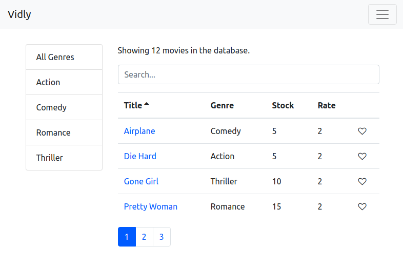

# Vidly Frontend

## Setup

Make sure to follow all these steps exactly as explained below. Do not miss any steps or you won't be able to run this application.

### Install MongoDB

To run this project, you need to install the latest version of MongoDB Community Edition first.

https://docs.mongodb.com/manual/installation/

Once you install MongoDB, make sure it's running.

### Install the Dependencies

Next, from the project folder, install the dependencies:

    npm i

### Start the App

    npm start

This will launch the Node server on port 3000. If that port is busy, you can set a different port.

Open up your browser and head over to:

http://localhost:3000

You should see the movie page.